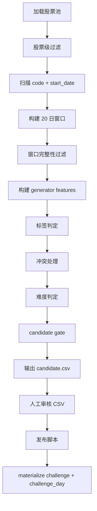

# Challenge Generator 主流程伪代码（v1 候选生成闭环版）

本文把 `docs/feature-formula-pseudocode.md` 与 `docs/challenge-generation-rules.md` 串成一套**可实现的离线出题主流程**。目标是让实现者可以直接按步骤写出 challenge generator，而不需要再临场决定“窗口怎么扫、何时剔除、何时输出 candidate”。

## 1. 目标与输入输出

### 1.1 职责边界
generator 的职责是：
- 扫描股票池与历史窗口
- 过滤不可玩样本
- 构建标签判定所需特征
- 生成待审核 candidate
- 在人工审核通过后，把 candidate 固化为 `challenge + challenge_day`

generator **不是**：
- 在线服务
- 前端接口
- 自动跳过人工审核直接发题的系统

### 1.2 输入
generator 第一版固定依赖以下输入：
- `stock_basic`
- `trading_calendar`
- `stock_daily_raw`
- `stock_daily_feature`
- `index_daily_feature`

补充说明：
- `stock_basic` 由交易所股票列表接口生成，`list_date` 不应再长期为空
- `trading_calendar` 由 `tool_trade_date_hist_sina` 生成
- `index_daily_feature` 由 `stock_zh_index_daily_em` 衍生

### 1.3 输出
第一阶段输出：
- `candidate.csv`
- `generator_debug_{generation_batch_id}.csv`
- `generator_run_log_{generation_batch_id}.csv`

第二阶段输出：
- `challenge`
- `challenge_day`

### 1.4 candidate.csv 最小字段
第一版 candidate 承载固定为离线 CSV / 表格，推荐至少包含以下列：

| 字段 | 说明 |
|---|---|
| `candidate_key` | 固定为 `{code}_{start_date}` |
| `code` | 股票代码 |
| `start_date` | 窗口起始交易日 |
| `end_date` | 窗口结束交易日 |
| `primary_tag` | 自动规则给出的主标签 |
| `secondary_tag` | 自动规则给出的辅标签，可空 |
| `difficulty` | `easy / normal / hard` |
| `score_explain_json` | 特征摘要、命中原因、难度摘要 |
| `rule_flags_json` | 命中标签、冲突状态、排除标记、是否需复核 |
| `review_status` | 默认 `PENDING` |
| `review_comment` | 人工备注，可空 |
| `adjusted_primary_tag` | 人工改后的主标签，可空 |
| `adjusted_difficulty` | 人工改后的难度，可空 |
| `generation_batch_id` | 本次生成批次 |

### 1.5 review_status 枚举
第一版固定枚举：
- `PENDING`：待审核
- `APPROVED`：审核通过，可进入发布脚本
- `REJECTED`：审核拒绝，不发布
- `REVIEW_REQUIRED`：自动规则判定冲突，需人工重点看

---

## 2. 主流程总图与总伪代码

## 2.1 主流程总图



## 2.2 总伪代码

```python
def run_generator(generation_batch_id, trade_date_from=None, trade_date_to=None):
    stock_pool = load_stock_pool(trade_date_from, trade_date_to)
    candidate_rows = []

    for stock in stock_pool:
        if not pass_stock_level_filter(stock):
            continue

        for start_date in tradable_start_dates(stock, trade_date_from, trade_date_to):
            window = build_window(stock.code, start_date, total_days=20)
            if window is null:
                continue

            if not pass_window_filter(window):
                continue

            features = build_generator_features(window)
            if features is null:
                continue

            index_features = load_index_features_for_window(stock, window)
            tag_result = classify_tags(window, features, index_features)
            if not tag_result.hit_any:
                continue

            tag_result = resolve_tag_conflict(tag_result)
            difficulty = classify_difficulty(window, features, tag_result)

            if not pass_candidate_gate(window, features, tag_result, difficulty):
                continue

            candidate_rows.append(
                build_candidate_row(
                    stock=stock,
                    window=window,
                    features=features,
                    tag_result=tag_result,
                    difficulty=difficulty,
                    generation_batch_id=generation_batch_id,
                )
            )

    emit_candidate_csv(candidate_rows, generation_batch_id)
```

## 2.3 固定核心函数名
第一版文档固定以下函数名，后续实现尽量直接映射：
- `pass_stock_level_filter`
- `tradable_start_dates`
- `build_window`
- `pass_window_filter`
- `build_generator_features`
- `classify_tags`
- `resolve_tag_conflict`
- `classify_difficulty`
- `pass_candidate_gate`
- `emit_candidate_csv`
- `materialize_challenge_from_reviewed_candidate`

---

## 3. 各阶段子流程定稿

## 3.1 阶段一：加载股票池
### 输入
- `stock_basic`
- 可选时间范围

### 输出
- 待扫描股票集合

### 前置条件
- 只处理 A 股日线

### 伪代码
```python
def load_stock_pool(trade_date_from=None, trade_date_to=None):
    stocks = query_stock_basic(status="LISTED_OR_HISTORY")
    return stocks
```

### 失败/跳过条件
- 主数据缺失代码、上市日期异常、市场字段异常

### 落盘产物
- 无

## 3.2 阶段二：股票级过滤
### 输入
- 单只股票静态信息

### 输出
- `True / False`

### 前置条件
- 使用静态主数据即可判断

### 伪代码
```python
def pass_stock_level_filter(stock):
    if stock.code is null:
        return False
    if stock.status in ["DELISTING", "DELISTED_RISK"]:
        return False
    if stock.stock_name startswith "ST" or stock.stock_name startswith "*ST":
        return False
    if stock.list_date is null:
        log_debug(stage="stock_filter", reason="missing_list_date", status="WARN")
    return True
```

### 失败/跳过条件
- ST / *ST
- 退市整理或高风险状态
- 静态主数据异常

### 落盘产物
- `generator_debug_{generation_batch_id}.csv` 中记录：
  - `missing_list_date`
  - `stock_status_filtered`
  - `st_name_filtered`

## 3.3 阶段三：扫描 `code + start_date`
### 输入
- 股票代码
- `trading_calendar`
- 生成时间范围

### 输出
- 一组 `start_date`

### 前置条件
- `start_date` 必须是开市日

### 伪代码
```python
def tradable_start_dates(stock, trade_date_from=None, trade_date_to=None):
    trade_dates = load_open_trade_dates(stock.exchange, trade_date_from, trade_date_to)
    for start_date in trade_dates:
        yield start_date
```

### 固定规则
- 候选键固定：`candidate_key = {code}_{start_date}`
- 每个窗口固定主窗口长度 `20`
- 若该标签依赖 `t+1 ~ t+3` 的标签验证特征，则要求验证窗口数据充足
- 第一版默认要求：
  - 主窗口：20 日
  - 额外验证窗口：最多再向后读取 3 日，但这些日线**不进入展示窗口**

### 失败/跳过条件
- `start_date` 后不足 20 个交易日
- 依赖后验验证特征时，不足额外验证窗口

### 落盘产物
- 无

## 3.4 阶段四：构建 20 日窗口
### 输入
- `code`
- `start_date`
- `stock_daily_raw`
- `stock_daily_feature`

### 输出
- `window`

### 前置条件
- 连续 20 个交易日可取到数据

### 伪代码
```python
def build_window(code, start_date, total_days=20):
    main_trade_dates = next_n_trade_dates(start_date, total_days)
    if len(main_trade_dates) != total_days:
        return null

    verify_trade_dates = next_n_trade_dates(main_trade_dates[-1], 3, include_start=False)

    raw_rows = load_stock_daily_raw(code, main_trade_dates + verify_trade_dates)
    feature_rows = load_stock_daily_feature(code, main_trade_dates + verify_trade_dates)

    return {
        "code": code,
        "start_date": start_date,
        "end_date": main_trade_dates[-1],
        "main_trade_dates": main_trade_dates,
        "verify_trade_dates": verify_trade_dates,
        "main_rows": pick_rows_by_dates(raw_rows, main_trade_dates),
        "verify_rows": pick_rows_by_dates(raw_rows, verify_trade_dates),
        "main_feature_rows": pick_rows_by_dates(feature_rows, main_trade_dates),
        "verify_feature_rows": pick_rows_by_dates(feature_rows, verify_trade_dates),
        "raw_rows": raw_rows,
        "feature_rows": feature_rows,
    }
```

### 失败/跳过条件
- 主窗口交易日不满 20
- 原始数据或特征数据无法按日期对齐

### 落盘产物
- 无

## 3.5 阶段五：窗口级过滤
### 输入
- `window`

### 输出
- `True / False`

### 前置条件
- 仅判断“是否可玩”，不判标签

### 伪代码
```python
def pass_window_filter(window):
    if not has_complete_main_window(window, total_days=20):
        return False
    if has_invalid_ohlc(window.main_rows):
        return False
    if has_missing_volume(window.main_rows):
        return False
    if has_indicator_gap(window.main_feature_rows):
        return False
    if has_long_suspension(window):
        return False
    if is_limit_one_word_dominant(window):
        return False
    return True
```

### 固定过滤规则
- OHLC 非法
- 成交量空值
- MA20 / KDJ / MACD 不完整
- 长期停牌或窗口内明显缺失
- 一字涨停 / 一字跌停主导
- 明显脏数据

### 落盘产物
- 可选写入 `rule_flags_json.excluded_reasons`

## 3.6 阶段六：构建 generator features
### 输入
- `window`
- `index_daily_feature`

### 输出
- `features`

### 前置条件
- 基础特征和标签验证特征必须分开

### 伪代码
```python
def build_generator_features(window):
    base_features = build_base_features_from_window(window)
    if base_features is null:
        return null

    validation_features = build_validation_features_if_needed(window, base_features)
    return {
        "base": base_features,
        "validation": validation_features,
    }
```

### 固定规则
- 基础特征统一以 `docs/feature-formula-pseudocode.md` 为准
- 标签验证特征只允许用于离线语义确认
- 基础特征不得使用未来数据
- `repair_signal_next_day` / `false_break_retrace` 只能进入验证层

### 落盘产物
- 可选写入 `score_explain_json.feature_snapshot`

## 3.7 阶段七：标签判定
### 输入
- `window`
- `features`
- `index_features`

### 输出
- `tag_result`

### 前置条件
- 直接调用既有阈值规则，不重复定义

### 伪代码
```python
def classify_tags(window, features, index_features):
    hits = []

    for tag_name in TAG_PRIORITY_ORDER:
        result = evaluate_tag_rule(tag_name, window, features, index_features)
        if result.hit:
            hits.append(result)

    return {
        "hit_any": len(hits) > 0,
        "hits": hits,
    }
```

### 固定规则
- 标签命中规则以 `docs/challenge-generation-rules.md` 为准
- 第 5 标签必须同时检查指数数据可用性
- 指数缺失时仅停用第 5 标签，不中断整个 candidate

### 失败/跳过条件
- 所有标签均未命中

### 落盘产物
- `rule_flags_json.tag_hits`

## 3.8 阶段八：冲突处理
### 输入
- `tag_result`

### 输出
- `primaryTag`
- `secondaryTag`
- `review_status`

### 前置条件
- 命中多个标签时必须统一处理

### 伪代码
```python
def resolve_tag_conflict(tag_result):
    ordered_hits = sort_by_priority(tag_result.hits)
    primary = ordered_hits[0]
    secondary = null
    review_status = "PENDING"

    if len(ordered_hits) >= 2:
        if is_explanatory_secondary(primary, ordered_hits[1]):
            secondary = ordered_hits[1]
        else:
            review_status = "REVIEW_REQUIRED"

    return {
        "primary_tag": primary.tag_name,
        "secondary_tag": secondary.tag_name if secondary else null,
        "review_status": review_status,
        "conflict_flags": build_conflict_flags(ordered_hits),
    }
```

### 固定规则
- 优先级完全沿用既有文档
- 最多保留 1 个 `secondaryTag`
- 若冲突过强：
  - 不直接自动剔除
  - 输出 `REVIEW_REQUIRED`
- 只有明显不可解释冲突，才在 `pass_candidate_gate` 中最终剔除

### 落盘产物
- `primary_tag`
- `secondary_tag`
- `rule_flags_json.conflict_flags`
- `review_status`

## 3.9 阶段九：难度判定
### 输入
- `window`
- `features`
- `tag_result`

### 输出
- `difficulty`

### 前置条件
- 难度表达误判概率，不表达未来收益刺激度

### 伪代码
```python
def classify_difficulty(window, features, tag_result):
    if has_clear_signal(window, features, tag_result) and has_low_conflict(features):
        return "easy"
    if has_high_conflict(features, tag_result) or has_false_signal_risk(features):
        return "hard"
    return "normal"
```

### 固定规则
- `easy / normal / hard`
- 用信号清晰度、冲突程度、假信号风险定档
- 不以结果涨跌幅大小定难度

### 落盘产物
- `difficulty`
- `score_explain_json.difficulty_reason`

## 3.10 阶段十：candidate gate
### 输入
- `window`
- `features`
- `tag_result`
- `difficulty`

### 输出
- `True / False`

### 前置条件
- 这里做最终“是否进入人工池”的判断

### 伪代码
```python
def pass_candidate_gate(window, features, tag_result, difficulty):
    if tag_result.primary_tag is null:
        return False
    if is_unplayable_even_if_tagged(window):
        return False
    if has_extreme_dirty_data_flag(window):
        return False
    return True
```

### 固定规则
- 主标签为空直接剔除
- 明显不可玩样本直接剔除
- 冲突样本允许进入 `REVIEW_REQUIRED`

### 落盘产物
- 无

## 3.11 阶段十一：输出 candidate.csv
### 输入
- candidate 列表

### 输出
- `candidate.csv`

### 伪代码
```python
def emit_candidate_csv(candidate_rows, generation_batch_id):
    path = f"output/candidate_{generation_batch_id}.csv"
    write_csv(path, candidate_rows)
    return path
```

### 固定规则
- 每次批次输出一个 CSV
- 文件名默认：
  - `candidate_{generation_batch_id}.csv`

### 落盘产物
- `candidate_{generation_batch_id}.csv`
- `generator_debug_{generation_batch_id}.csv`
- `generator_run_log_{generation_batch_id}.csv`

---

## 4. candidate 输出与人工审核边界

## 4.1 generator 与人工的边界
第一版采用：
- generator 自动产出 `candidate.csv`
- 人工直接在 CSV / 表格中审核
- 审核通过的行再进入发布脚本

generator 不负责：
- 人工后台
- 权限系统
- 在线审核页面

## 4.2 人工审核允许的操作
人工只能对以下项目做有限修改：
- `review_status`
- `review_comment`
- `adjusted_primary_tag`
- `adjusted_difficulty`

## 4.3 人工审核限制
- 最多只允许调整一项：
  - 要么改主标签
  - 要么改难度
- 若主标签和难度都需要改：
  - 该 candidate 退回
  - `review_status = REJECTED`
  - 不进入正式 challenge

## 4.4 发布脚本边界
审核后的 CSV 再交给发布脚本：

```python
def materialize_challenge_from_reviewed_candidate(reviewed_row, generation_batch_id):
    challenge_id = build_challenge_id(reviewed_row)
    challenge = build_challenge_row(reviewed_row, challenge_id, generation_batch_id)
    challenge_days = build_challenge_day_rows(reviewed_row, challenge_id, generation_batch_id)
    persist(challenge, challenge_days)
```

reviewed CSV 模板、发布脚本输入输出与入库规则详见 `docs/review-and-publish-toolchain.md`。

第一版不实现后台，不新增 `challenge_candidate` 表。

---

## 5. challenge_id / version 默认规则

## 5.1 默认命名规则
第一版固定：

```text
challenge_id = {code}_{start_date}_{primaryTagShort}_{version}
```

示例：

```text
000001_2018-06-01_breakout_v1
```

## 5.2 primaryTagShort 固定映射
第一版固定映射如下：

| primaryTag | primaryTagShort |
|---|---|
| 下跌中继 vs 真见底 | `bottom` |
| 放量突破 vs 假突破 | `breakout` |
| 高位放量阴线 | `highvolbear` |
| 缩量回踩均线 | `pullback` |
| 大盘恐慌日该不该抄底 | `panic` |
| 连续上涨后该持有还是止盈 | `takeprofit` |

## 5.3 version 规则
- 默认从 `v1` 开始
- 同一窗口若因历史补数、规则修订、人工筛题调整而重发：
  - 不覆盖旧题
  - 生成新 `challenge_id`
  - `version` 递增
  - `generation_batch_id` 必须变化

## 5.4 版本示例
- 第一次发布：`000001_2018-06-01_breakout_v1`
- 第二次重发：`000001_2018-06-01_breakout_v2`

---

## 6. 与现有文档的关系

### 6.1 职责分工
- `docs/feature-formula-pseudocode.md`
  - 定义特征公式、伪代码、边界处理
- `docs/challenge-generation-rules.md`
  - 定义标签阈值、优先级、难度口径
- `docs/challenge-generator-main-flow.md`
  - 定义 generator 主流程如何串联窗口、特征、标签、candidate、审核边界
- `docs/data-init-flow.md`
  - 定义 generator 在整条数据初始化链路中的位置

### 6.2 最终实现建议
第一版最稳的落地方式是：
- 用离线脚本扫描历史窗口
- 输出 `candidate.csv`
- 用人工审核把控题目质量
- 再把审核通过的 candidate 固化成 `challenge + challenge_day`

也就是说：

> **v1 challenge generator 不是“自动上线系统”，而是“自动候选生成器 + CSV 审核输入 + 冻结发布入口”。**
