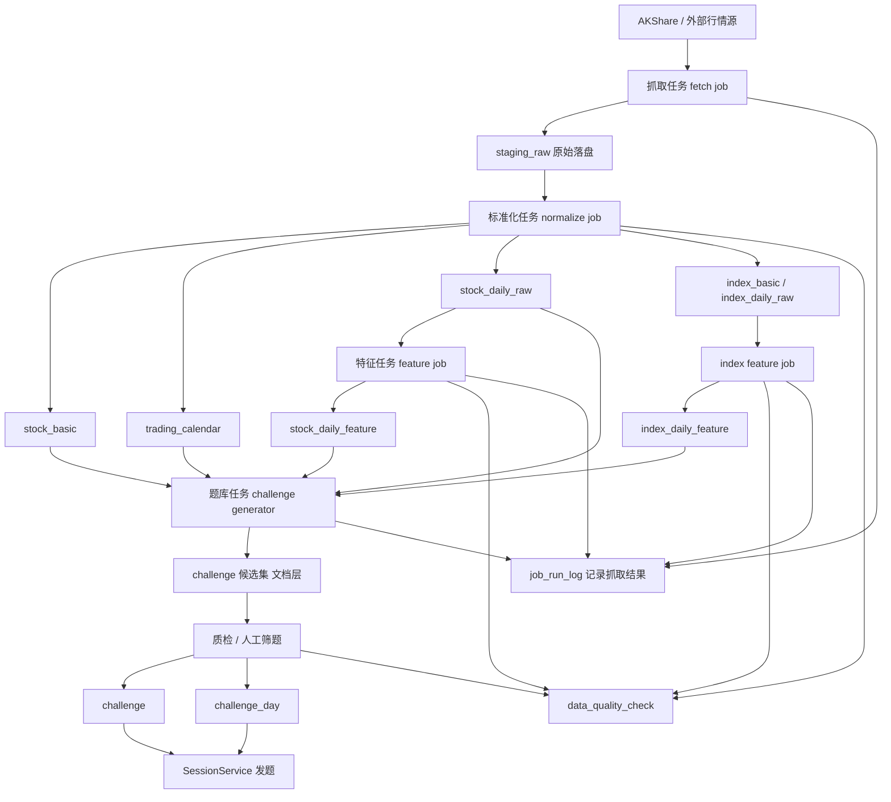
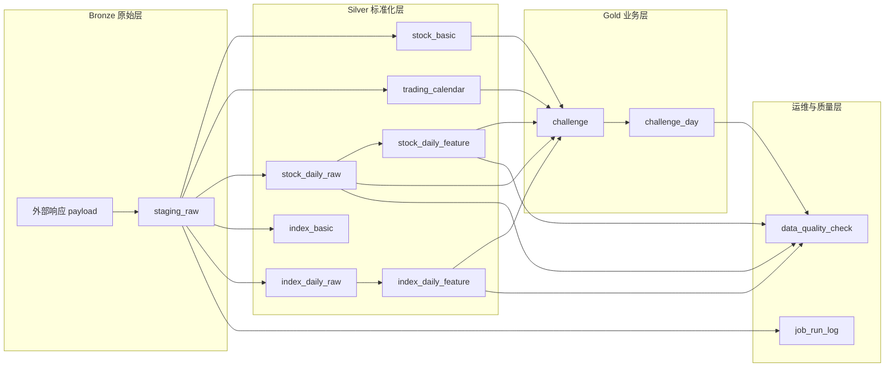
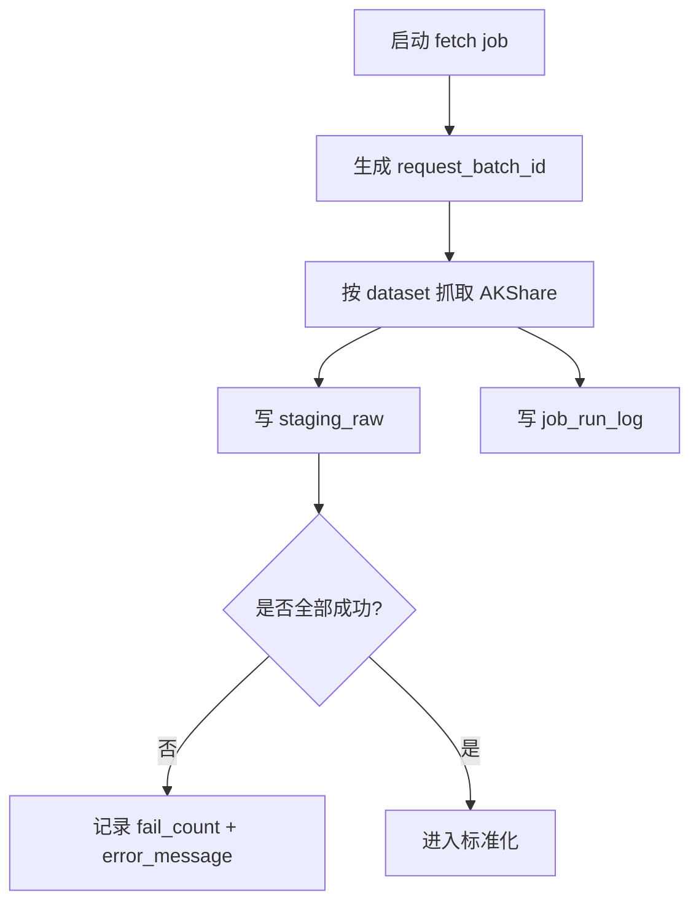
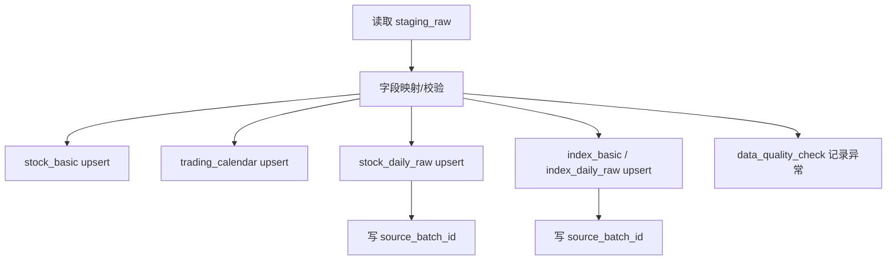
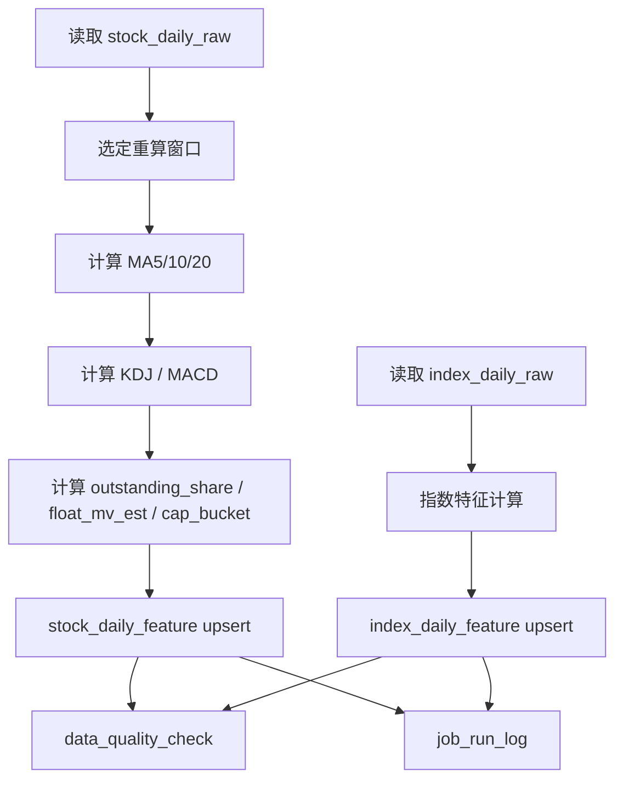
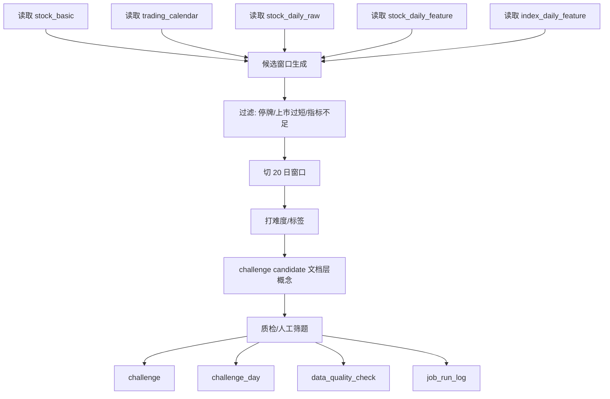
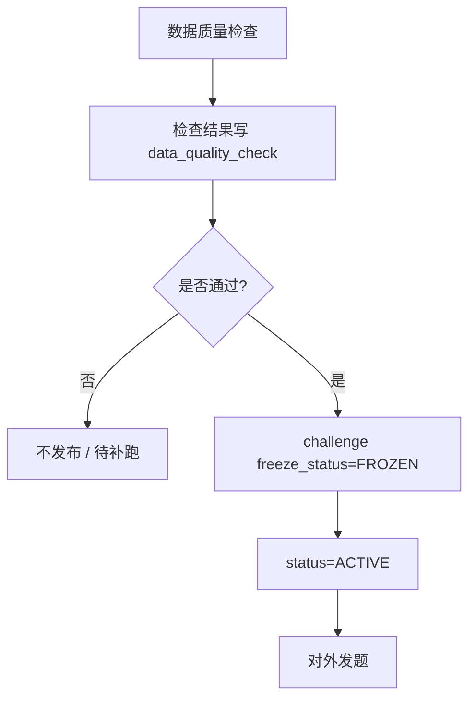

# 数据初始化流程图与设计评审（运营闭环版）

本文回答五个问题：
1. 数据从哪来
2. 数据如何分阶段落库
3. 失败后如何补跑和恢复
4. 哪些设计继续坚持
5. 哪些地方不合理或只是 v1 暂时接受

---

## 1. 总体流程图

---

## 2. 分层模型

### 为什么这套分层合理
- 原始抓取和业务表分开，方便排障
- 标准化层支持幂等 upsert 和定向补数
- 题库层只消费稳定数据，不直接依赖抓取结果
- 运维层把“失败、异常、补跑”结构化，不再靠人工记忆

---

## 3. Phase A：抓取层

### 规则
- 每次抓取必须生成 `request_batch_id`
- `staging_raw` 保存原始 payload，不直接删除
- 一次任务失败，也要有 `job_run_log`
- 支持按 `dataset + biz_key` 定向补抓

### 合理点
- 能回放原始数据
- 能定位失败范围
- 能做 checksum 排查“同 key 不同 payload”问题

### 不合理点（若不这样做）
- 直接抓取后立刻清洗入库，一旦字段变化，很难知道问题源头
- 没批次号时，补跑会把新旧数据混在一起

---

## 4. Phase B：标准化层

### 规则
- `stock_basic`、`trading_calendar`、`stock_daily_raw`、`index_basic`、`index_daily_raw` 按主键幂等 upsert
- `stock_daily_raw` 唯一键是 `code + trade_date`
- `index_daily_raw` 唯一键是 `index_code + trade_date`
- 同一批次发现异常：
  - 缺字段
  - 重复日期
  - OHLC 非法
  - 停牌日价格异常
  都写入 `data_quality_check`

### 失败恢复
- 抓取失败：按 `biz_key` 补抓
- 标准化失败：按 `request_batch_id` 重新跑 normalize
- 单条坏数据：按 `code + trade_date` 定向修复

### 合理点
- 幂等 upsert 适合日常增量
- source_batch_id 可以追踪数据来源

### 不合理点
- 每次重新导全量历史，容易覆盖坏数据、慢且难恢复
- 不做数据校验直接进标准表，会把脏数据传染到特征层和题库层

---

## 5. Phase C：特征层

### 规则
- 初始化时可全量计算
- 日常只重算最近 **60~90 日窗口**
- 历史只在补数或修正时定向重算
- `float_mv_est = raw_close * outstanding_share` 明确标记为**估算值**
- 股票特征与题库规则共享统一公式口径，详见 `docs/feature-formula-pseudocode.md`
- 指数特征第一版只做：
  - `pct_change_1d`
  - `drawdown_5d`
  - `vol_ratio_1d_5d`
  - `panic_flag`
- 指数主数据第一版固定维护沪深核心 3 指数：
  - 上证指数
  - 深证成指
  - 创业板指

### 失败恢复
- 特征失败：按 `code + date_range` 重算
- 指标空值或窗口不足：记录 `data_quality_check`

### 合理点
- 局部重算比全量历史重算更稳、更省资源
- 指标层和原始层分离，便于升级指标算法版本

### 不合理点
- 把 `float_mv_est` 当成精确历史流通市值
- 每日全市场全量重算全历史

---

## 6. Phase D：题库层

### 规则
- `challenge_candidate` 本轮只作为流程概念，不强制落表。
- 题库详细生成规则见 `docs/challenge-generation-rules.md`。
- 特征公式、伪代码与边界处理见 `docs/feature-formula-pseudocode.md`。
- generator 主流程伪代码与 candidate 输出边界见 `docs/challenge-generator-main-flow.md`。
- 第一版固定采用：
  - 自动候选 + 阈值规则赋值
  - 固定 6 类标签
  - 三档难度：`easy / normal / hard`
  - 多标签按优先级表定主标签
  - 第 5 类标签依赖 `index_daily_feature`
  - 第 5 类标签内部固定参考沪深核心 3 指数：上证指数、深证成指、创业板指
  - 指数数据缺失时直接停用第 5 类标签
  - 人工最多只允许微调一项
- challenge 写入时同步生成 `generation_batch_id`。
- challenge 发布后 `freeze_status = FROZEN`。

### 失败恢复
- 某批出题失败：按 `generation_batch_id` 整批回滚或重生
- 题目质检不通过：保留候选规则，不写正式 challenge

### 合理点
- challenge 与 challenge_day 一起固化，历史题不会漂移。
- 先候选、后筛题，题目质量更可控。
- 固定标签、固定难度、固定优先级表，便于第一版统一运营口径。
- 第 5 类标签只在指数条件完整时启用，能保证语义纯度。

### 不合理点
- 直接从实时特征表动态发题。
- 自动生成后完全不做人工筛查就上线。
- 第一版就做开放式标签体系，导致口径漂移。
- 不定义阈值边界，只靠人工“感觉打标签”。
- 指数数据缺失时硬用个股规则凑出“恐慌日抄底”标签。

---

## 7. Phase E：质检与发布

### 发布规则
- challenge/challenge_day 一经发布冻结
- 不做覆盖更新，只允许：
  - 新增版本
  - 下线旧题
- 已有 user_session/user_result 的 challenge 不允许原地改内容
- 审核与发布工具链详见 `docs/review-and-publish-toolchain.md`

### 这是合理的原因
- 榜单口径稳定
- 历史结果可回放
- 题目不会因补数发生“昨天和今天不一样”

---

## 8. 稳定性场景与恢复策略

### 场景 1：AKShare 某天部分股票抓取失败
- 表现：`staging_raw` 缺部分 biz_key，`job_run_log.fail_count > 0`
- 处理：按 `dataset + biz_key + batch_date` 补抓
- 不要做法：整批全量重抓覆盖历史数据

### 场景 2：特征计算中断
- 表现：`stock_daily_raw` 已有，但 `stock_daily_feature` 缺部分 code/date
- 处理：按 `code + date_range` 重跑 feature job
- 不要做法：重新抓全市场全历史原始行情

### 场景 3：challenge 生成到一半失败
- 表现：`challenge` 写了一部分，`challenge_day` 不完整
- 处理：按 `generation_batch_id` 回滚或重生整批
- 不要做法：手工补单条 day 记录混过去

### 场景 4：历史补数后已上线题目漂移
- 正确策略：已上线题目不改，重新生成新 challenge 版本
- 不要做法：直接覆盖旧 `challenge_day`

---

## 9. 继续坚持 / 需要收敛 / 暂不做

### 继续坚持
- 前复权展示、原始价结算
- `challenge` 与 `challenge_day` 分离
- 后端统一结算
- 离线批处理出题
- challenge 发布后冻结

### 需要收敛
- 直接依赖 AKShare 单点在线抓取
- 抓取/清洗/入库/出题耦合成单脚本
- 全市场历史全量重算
- 不做批次追踪
- 不保留原始 staging 数据
- 把 `float_mv_est` 当成精确历史流通市值

### 暂不做但保留接口
- 多数据源比对
- 自动告警
- challenge 人工审核后台
- 题目 AB 投放
- challenge_candidate 落表

---

## 10. 当前版本最合理的落地方式

结合你现在的资源，最稳的版本是：

> **AKShare + staging_raw + MySQL 标准化层 + 特征层增量重算 + challenge/challenge_day 固化 + job_run_log/data_quality_check 审计闭环**

这是第一版最现实，也最不容易把自己埋坑里的方案。
