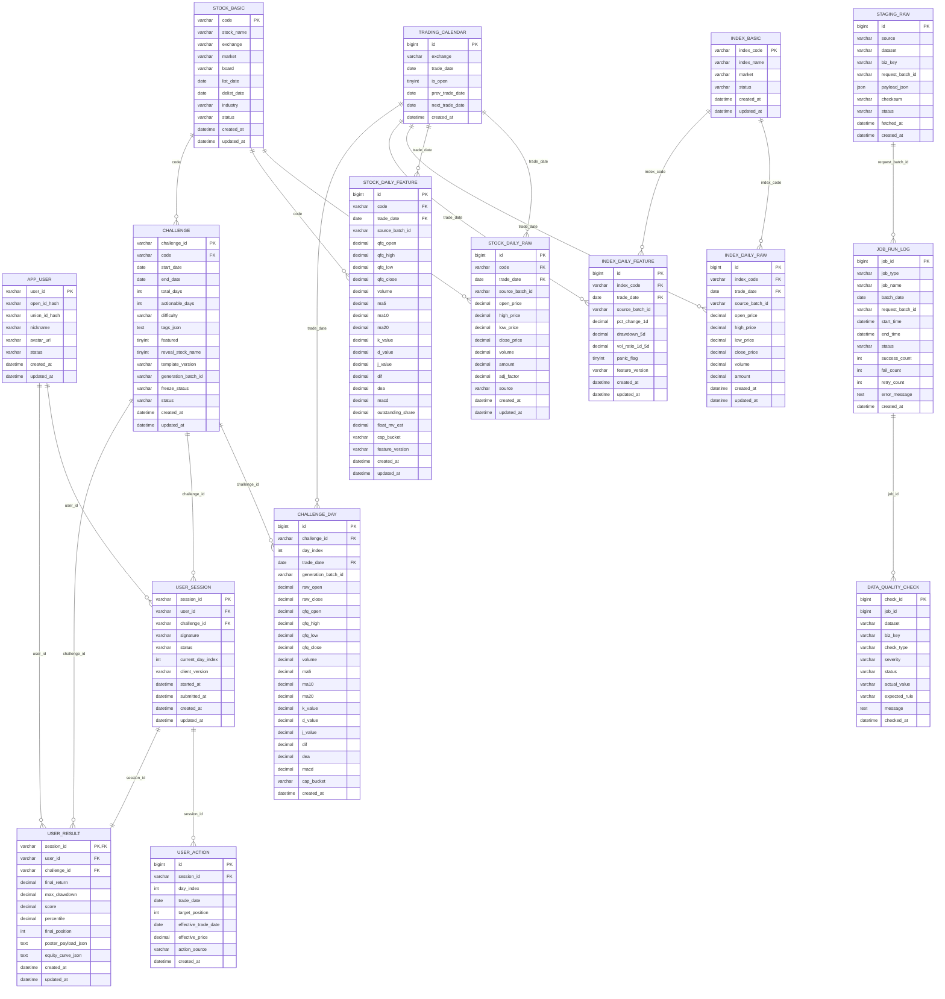

# 数据库 ER 图（运营闭环版）

这版 ER 图按“**可回放、可补跑、可审计、可冻结**”设计：
- 外部抓取先进入原始暂存层，不直接写业务表
- 标准化层与业务题库层分离
- challenge 与 challenge_day 固化，避免历史题目漂移
- 任务日志与质检记录独立，便于补跑与审计

## ER 图

## 分层说明

### 1. 主数据层
- `app_user`：用户主体，后续接微信登录。
- `stock_basic`：股票静态主数据。
- `trading_calendar`：统一交易日口径，支撑“次日开盘成交”。

### 2. 抓取与运维层
- `staging_raw`：保存外部抓取原始结果，作为回放和排障基准。
- `job_run_log`：保存抓取、特征、出题等任务执行记录。
- `data_quality_check`：保存缺失、重复、异常波动、空指标、窗口不完整等质检结果。

这三张表不直接参与小程序查询，但对数据稳定性至关重要。

### 3. 行情与特征层
- `stock_daily_raw`：原始行情，供结算使用。
- `stock_daily_feature`：前复权展示数据、技术指标、市值标签，供出题和展示使用。
- `index_basic / index_daily_raw / index_daily_feature`：指数专用主数据、原始日线与特征表，只服务于第 5 类标签的内部语义判断；第一版固定维护上证指数、深证成指、创业板指。
- `source_batch_id` 用来追踪当前这条标准化数据来自哪一批抓取/重算。

### 4. 题库层
- `challenge`：题目元信息。
- `challenge_day`：题目每日快照。
- `generation_batch_id` 用于标识这道题来自哪一批生成任务。
- `freeze_status` 用于标识题目是否已冻结发布。
- `challenge.difficulty` 第一版固定枚举：`easy / normal / hard`。
- `challenge.tags_json` 第一版推荐包含：`primaryTag`、`secondaryTag`、`tagVersion`。
- 第 5 类标签逻辑依赖 `index_daily_feature`，但指数数据不进入前端展示接口。
- 若 challenge 窗口对应的指数数据缺失、批次不完整或质检未通过，则第 5 类标签直接停用，不做个股替代降级。
- 标签与难度的具体阈值规则见 `docs/challenge-generation-rules.md`。
- 若未来需要落地 candidate 阶段，再扩 `challenge_candidate`，本轮不新增表。

### 5. 对局层
- `user_session`：一局实例。
- `user_action`：用户每日目标仓位。
- `user_result`：后端最终重算结果。

## 为什么这样设计更合理

### A. staging_raw 保留原始输入，能回放
AKShare 某天字段变了、某只股票缺了、某批数据半成功时，可以回查原始 payload，而不是只能猜测清洗哪里出错。

### B. job_run_log 让“补跑”有抓手
没有任务日志，就很难知道：
- 哪次抓取失败
- 哪次特征计算中断
- 哪次 challenge 生成只完成了一半

### C. data_quality_check 让“质检”从口头要求变成结构化记录
后续可以逐步把规则扩成：
- 重复 trade_date
- 缺失交易日
- OHLC 非法
- MA/KDJ/MACD 空值
- challenge 20 日窗口不完整

### D. challenge + challenge_day 固化，避免历史题目漂移
一旦题目发布，展示和结算都依赖快照，不再回读实时特征表。

### E. batch_id / generation_batch_id 保证可追溯
- 一条行情来自哪次抓取
- 一个特征来自哪次重算
- 一道题来自哪次生成

都可以回查。

## 继续坚持 / 需要收敛 / 暂不做

### 继续坚持
- 前复权展示、原始价结算
- `challenge` 与 `challenge_day` 分离
- 后端统一结算
- 离线批处理出题
- challenge 发布后冻结

### 需要收敛
- 直接依赖 AKShare 单点在线抓取
- 抓取/清洗/入库/出题全耦合单脚本
- 全市场历史全量重算
- 不固化 challenge 快照而直接从实时特征表发题
- 把 `float_mv_est` 当精确历史流通市值

### 暂不做但预留接口
- 多数据源交叉验证
- 自动告警平台
- challenge 人工审核后台
- 题目 AB 投放和灰度发布

## 当前与代码实现的关系
当前 Java 代码仍是内存样例实现；下一步若落 MySQL，建议优先按本图补齐：
- `staging_raw`
- `job_run_log`
- `data_quality_check`
- `challenge_day`

这样数据初始化链路才算真正闭环。
